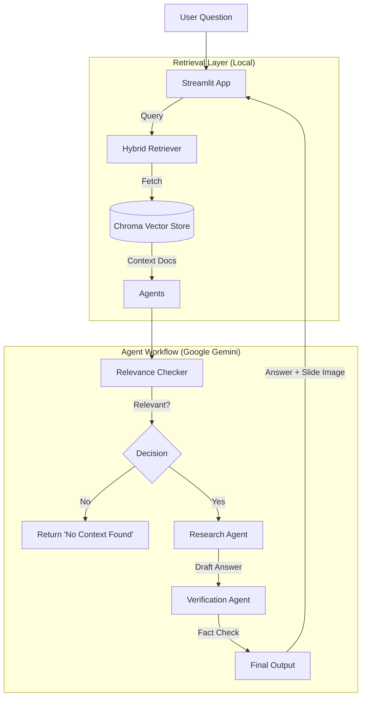

#  Lecture RAG Assistant

A Retrieval-Augmented Generation (RAG) application designed to provide accurate, verified answers from lecture videos. This tool ingests lecture transcripts and slides, indexes them using local embeddings(slide content, slide image and lecturer transcript, every 20 seconds), and uses a multi-agent workflow to answer user questions with citations and visual references.

##  System Architecture

The system uses a **Hybrid Retrieval** approach (combining Keyword and Vector search) and a **LangGraph Multi-Agent Workflow** to ensure high-quality responses.

## Agents & Components

The system relies on three specialized AI agents working in sequence to prevent hallucinations and ensure relevance.

### 1. Relevance Checker
* **Model:** `gemini-2.5-flash`
* **Role:** The Gatekeeper.
* **Function:** It analyzes the retrieved documents against the user's question to determine if there is enough information to answer. If the context is irrelevant, it halts the process early to save resources and avoid making up answers.

### 2. Research Agent
* **Model:** `gemini-2.5-pro`
* **Role:** The Writer.
* **Function:** Once relevance is confirmed, this agent synthesizes the retrieved transcripts and slide text into a coherent, concise draft answer. It is strictly instructed to use *only* the provided context.

### 3. Verification Agent
* **Model:** `gemini-2.5-pro`
* **Role:** The Critic.
* **Function:** This agent reviews the Research Agent's draft against the original source documents. It checks for hallucinations, unsupported claims, or contradictions. It outputs a verification report that determines if the answer is safe to show the user.

## Tech Stack

* **Frontend:** Streamlit
* **Orchestration:** LangChain & LangGraph
* **LLMs:** Google Gemini (1.5 Flash & Pro) via `google-genai` SDK
* **Embeddings:** Local Ollama (`nomic-embed-text`)
* **Vector Database:** ChromaDB
